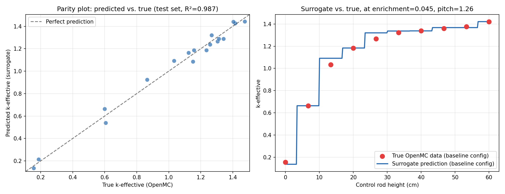

# SMR AI Digital Twin

## Project Overview

The SMR AI Digital Twin Project approximates the physics that occurs within a small modular nuclear reactor at high speeds, allowing for a fast and accurate k-effective output based on certain physical parameters. The OpenMC neutronics pipeline generates real simulation data, using variable geometry, fuel enrichment level, and control rod insertion. After obtaining the data of 90 different reactor configurations, the k-effective values are organized and consolidated into a CSV file. Using the scikit-learn module, I used the CSV to train my surrogate model to predict the k-effective value based on the physical parameters without running a simulation. This allowed me to obtain the k-effective value much faster, saving time and computation. Running these simulations take measurable amounts of time to run and output a k-effective value, but utilizing AI allows these runtimes to be reduced from 16.0 seconds to 1.1 milliseconds — making the AI predictions more than 14,000 times faster than a quick simulation. This project is a step towards tools that can be utilized as real-time reactor control or risk-free nuclear research. The simulation-based approach also allows for reactor iteration, design, and experimentation without using the time/materials and eliminating the safety risks.

## Physics Specifications

The model SMR is based off these parameter values' range and baseline:

| Parameter | Value |
|---|---|
| Fuel | UO₂, enrichment 3–7% swept (0.03/0.045/0.07), 4.5% baseline |
| Fuel pin radius | 0.4096 cm |
| Cladding | Zircaloy-4, outer radius 0.475 cm |
| Moderator | Light water, with `c_H_in_H2O` S(α,β) thermal scattering |
| Absorber | B4C control rod |
| Pin pitch | 1.10–1.42 cm swept, 1.26 cm baseline |
| Core height | 60 cm, reflective boundaries |

The variable I am tracking using the OpenMC neutronics pipeline is k-effective, represented by this equation:

k-effective = [neutrons produced (n+1)] / [neutrons absorbed + neutrons leaked (n)]

However, since this model uses reflective boundaries on every surface, there is no neutron leakage; neutrons that would escape are instead reflected back into the simulated cell. This effectively models an infinite repeating lattice rather than a finite, real-world reactor core, which is why the benchmark comparison in Day 49 is made against a published k∞ value rather than a true k-effective from an actual reactor.

## Installation and Reproducibility Guide

1. Clone this repository:
   ```bash
   git clone https://github.com/gedamura/SMR-AI-DigitalTwin.git
   cd SMR-AI-DigitalTwin
   ```

2. Install OpenMC (requires conda-forge) and other required programs:
   ```bash
   pip install -q condacolab
   python -c "import condacolab; condacolab.install()"
   # restart runtime, then:
   mamba install -y -c conda-forge openmc
   pip install -r requirements.txt
   ```

3. Run the physics pipeline:
   ```bash
   python run_sweep.py       # Runs all 90 real OpenMC configurations
   python build_dataset.py   # Assembles the real dataset from statepoints
   ```

4. Train and evaluate the surrogate model:
   ```bash
   python data_splitting.py      # 80/20 train/test split on all 3 features
   python evaluate_surrogate.py  # Compares linear vs. tree, depth sensitivity sweep
   python save_digital_twin.py   # Trains and saves the final model on full dataset
   ```

## Visual Proof & Performance Metrics

| Metric | Result |
|---|---|
| Configurations | 10 rod heights × 3 enrichments × 3 pitches = 90 configurations |
| R² | 0.9868 |
| MSE | 2.05 × 10⁻³ |
| Prediction speed vs. full simulation | 1.10 ms vs. 15.99 s |



---

## Development Log

### Day 49 — Benchmark Validation

The baseline nuclear reactor simulation was designed to mimic the parameters referenced in the ReactorMC Serpent pin-cell tutorial, a third-party educational reference modeling a Westinghouse-style 17×17 PWR pin-cell configuration (4.5% enriched UO2 fuel, radius r=0.4096 cm, Zircaloy-4 cladding, outside radius OR=0.475 cm, pitch p=1.26 cm, reflective boundary conditions). The tutorial reports an expected k∞ range of 1.31–1.35, while my model computed a combined k-effective of 1.42166 ± 0.00127. Assuming the tutorial's expected k∞ to be theoretically true, my model would yield a percent error of 5.31%–8.52%. However, it should be noted that this reference is not a peer-reviewed benchmark report, so use of this data was solely cited for order-of-magnitude validation.

Additionally, this model has a few differences compared to the reactor configuration modeled in the ReactorMC tutorial. Primarily, my model does not assign material temperatures to the fuel, cladding, and moderator (all defaulted to ~300K), while the tutorial states that the reactor was operating at much hotter temperatures (fuel 900K, cladding 600K, water 574K). Because my simulation ran at a lower temperature relative to the tutorial's configuration, my model had a lower neutron capture due to the Doppler broadening of U-238. Essentially, my model overestimated the k∞ due to these parameters being ignored, suggesting that my model is more accurate than the calculated percent error shows. The tutorial's reactor also had a layer of Helium around the core; however, this should not significantly change the data. The appearing delta between the expected value and my experimental value is consistent, but not yet confirmed to be fully explained by these missing features.

### Day 50 — Control Rod Channel Validation

A control rod was implemented into this model's simulation, being a movable absorber within the reactor core. The fuel and cladding remain constant while the surrounding channel switches between B4C absorber and light water moderator. The B4C absorber occupies the channel above the tip, while the light water moderator occupies the channel below the tip, separated by a z-plane at `control_rod_height`. To confirm that the rod physics behaved as expected, three different rod positions were simulated to compare each k-effective yield.

| Rod height (cm) | State | k-effective |
|---|---|---|
| 0.0 | Fully inserted | 0.15577 ± 0.00024 |
| 30.0 | Mid-core | 1.29068 ± 0.00162 |
| 60.0 | Fully withdrawn | 1.42181 ± 0.00145 |

k-effective decreases monotonically as the rod inserts, consistent with expected reactor physics. When a control rod is fully inserted, the system becomes deeply subcritical (k<1) shown by yielding a k-effective value of 0.15577 ± 0.00024. For an internal consistency check, when the rod is fully withdrawn, the k-effective is still consistent with the value observed from Day 49 within statistical uncertainty, confirming that the rod channel did not alter the simulation physics while the channel is entirely moderator.

However, there are limitations to the control rod physics and geometry. The rod tip is forced to stay 0.001 cm inside the true core boundaries (not exactly 0.0 or 60.0 cm) to avoid a coincident-surface particle-loss error in OpenMC. This limitation is physically negligible relative to the core's 60 cm height, and does not measurably change the recorded k-effective values.

### Day 51 — Parametrizing the Geometry Compiler

The function `compile_reactor_core()` was changed to accept `enrichment` and `pin_pitch` as parameters with `control_rod_height`, instead of being set to a hardcoded fuel composition and spacing. This change required me to convert `build_materials.py` from a module-level script into a `build_materials(enrichment)` function, since the fuel material's U-235 cannot be set at import time if the variable needs to change per sweep configuration. To ensure changing physical parameters changes the reactor physics as expected, I simulated these three configurations to compare the k-effective value.

| Config | Enrichment | Pitch (cm) | k-eff | Δk vs. default | Significance |
|---|---|---|---|---|---|
| Default | 4.5% | 1.26 | 1.42181 ± 0.00145 | — | — |
| High enrichment | 7.0% | 1.26 | 1.48135 ± 0.00147 | +0.0595 | ~29σ |
| Tight pitch | 4.5% | 1.10 | 1.29609 ± 0.00127 | −0.1257 | ~65σ |

Having a higher enriched fuel raises the k-eff (consistent with reactor physics); tighter pin pitch under-moderates the thermal lattice and lowers k-eff (also consistent with reactor physics). Being 29 and 65 standard deviations away from the control respectively, these changes cannot be explained purely by statistical uncertainty, confirming that these parameters affect the simulation in the way we would expect. The default configuration result also reproduces the Day 49 value, confirming the refactor didn't change the model's underlying physics.

### Day 52 — Bounded Parameter Grid

The function `build_sweep_grid()` creates a 3-dimensional (rod_height × enrichment × pitch) parameter grid. This grid consists of 10 rod positions from 0–60 cm, 3 different enrichment levels (3%, 4.5%, 7%), and 3 pitch options (1.10, 1.26, 1.42). This creates 90 total configurations, a deliberate ceiling rather than an exhaustive search. The grid parameter values are centered on the Day 49/50 validated baseline (`enrichment=0.045`, `pitch=1.26`) and bracketed by the exact extremes already checked in Day 51, so the sweep explores parameter ranges already known to behave in a physically plausible way.

### Day 53 — Automated Execution Loop

The file `run_sweep.py` loops through all 90 grid configurations, using the function `compile_reactor_core()` and running OpenMC for each simulation. OpenMC names statepoint output files after the batch count, meaning each iteration of the 90 runs would continuously overwrite the previous file, only leaving data of the last run. To avoid this, each statepoint had to be renamed to `statepoint_run<index>.h5` after it was produced.

`openmc.run(output=False)` keeps the terminal output manageable across 90 runs. Settings for the sweep use a lighter configuration than the single simulations' baselines (`batches=30, inactive=5, particles=1000` compared to `120/20/4000`) for runtime feasibility. This trades statistical precision for speed. The standard deviation for these runs is about 4 times larger than the full-precision operations. However, it was verified by Day 51's checks that changes to enrichment/pitch had effects much larger than statistical variance, therefore making analysis with a larger standard deviation still safe. Both `build_settings()` and `build_materials()` are now functions that accept these choices as parameters rather than hardcoding one setting, making precise and fast runs both available with the same functions.

### Day 55/56 — Real Statepoint Scraping & Dataset Assembly

The file `build_dataset.py` obtains k-effective (mean and standard deviation) from each `statepoint_run<index>.h5` file and creates `smr_neutronics_dataset.csv`. Rows with a missing statepoint are logged to `pipeline_failures.log` and excluded from the CSV file instead of replaced with an estimated value. All 90 out of 90 runs were simulated and logged successfully.

The file `plot_sweep_results.py` plots k-effective vs. rod height, sliced by enrichment (pitch held at baseline) and by pitch (enrichment held at baseline). The results confirm the dataset behaves in a physically probable way before using it to train the AI model.

- K-effective rises as rod height increases (60 cm = fully withdrawn, 0 cm = fully inserted)
- Higher enrichment and wider pitch consistently produce higher k-effective values at every rod height
- Error bars are negligible at this scale relative to the enrichment/pitch/rod height effects, showing true effect instead of statistical variability
- The baseline parameters match the observed values obtained from days before

A characteristic of these graphs worth noting is that the k-effective vs. rod height has a shape closer to a log function, rather than a logistic growth function that is typically obtained. This could plausibly be explained by the simplified geometry of the reactor, since the channel model is 1-dimensional rather than 3-dimensional.

### Day 57 — Dataset Verification

`ml_foundations.py` loads the data obtained from `smr_neutronics_dataset.csv` and confirms all three physical parameters (`control_rod_height_cm`, `enrichment`, `pin_pitch_cm`) actually vary before training starts. I also did not use a synthetic-data fallback, so I had to ensure all expected values were in the CSV file.

### Day 58 — Feature Extraction & Split

The file `data_splitting.py` splits the data 80/20 (72 runs to train, and 18 to test, `random_state=42`) using all three physical parameters as features. Test set coverage confirmed all three enrichment levels and all three pitch levels are represented in the 18-row test set.

### Day 59 — Linear Regression Baseline

The file `linear_surrogate.py` fits a 3-feature linear model. All three coefficient signs matched the physical expectations. Range-weighted, rod height, enrichment, and pitch contributed roughly comparable total swings to k-effective across the dataset (~0.99, ~0.094, ~0.104 respectively) despite very different coefficient magnitudes.

### Day 60 — Decision Tree Regressor

The file `tree_surrogate.py` fits a `DecisionTreeRegressor` on all three features. Initially I used `max_depth=5`, which produced an unexpected feature importance split (95.4% rod height, 1.8% enrichment, 2.8% pitch) relative to Day 59's range-weighted linear contributions.

### Day 61 — Statistical Validation & Depth Sensitivity Sweep

The file `evaluate_surrogate.py` properly compared the linear and tree models, then ran a depth sensitivity sweep (`max_depth=3, 5, 8, 10, unlimited`) to test whether the importance split produced by `max_depth=5` is accurate or inaccurate due to insufficient tree depth.

Test R² climbed from 0.954 (depth=3) through 0.977 (depth=5) to 0.987 (depth=8), then plateaued as `max_depth` increased further, showing that the tree stops finding useful splits after 8. Enrichment and pitch importance stayed essentially flat across the sweep (~2%/3%), showing that the tree having insufficient depth was not causing an accuracy issue with the importance split, since their importance percentages would have risen as `max_depth` increased.

Since `max_depth=8` was found to be the most accurate depth without unnecessary splits, it was adopted as the final tree configuration.

| Model | Test R² | Test MSE |
|---|---|---|
| Linear Regression (3 features) | 0.7084 | 4.52e-02 |
| Decision Tree (depth=8) | 0.9868 | 2.05e-03 |

### Day 62 — Visual Validation

The file `plot_predictions.py` produced two plots: a parity plot (predicted vs. true test set) and a sliced line plot at baseline enrichment/pitch. The parity plot showed many points very close to and around the perfect-prediction line, consistent with R² = 0.987. The slice plot revealed a visibly "stair-stepped" prediction curve with test points near these prediction functions.

The stair-step shape of the prediction function suggested the true rod height response might be log-shaped rather than linear. Tested directly with a log-featured linear regression (`log(rod_height+1)` in place of raw rod height), R² significantly increased from 0.708 (linear) to 0.963, strong confirmation that the true relationship is log-shaped. However, the tree prediction graph still outperformed the log regression line (R² = 0.987 vs. 0.963, ~2.8x lower MSE), indicating the tree captures the real structure beyond a single log transform.

### Day 63 — Final Model Serialization

The file `save_digital_twin.py` trains `DecisionTreeRegressor(max_depth=8)` on the full 90-row dataset and saves it via `joblib` as `smr_digital_twin_model.pkl`, alongside metadata JSON recording feature order, target column, validated test R²/MSE, and the model selection reasoning. I did a reload check to confirm the saved model loads and operates correctly.
